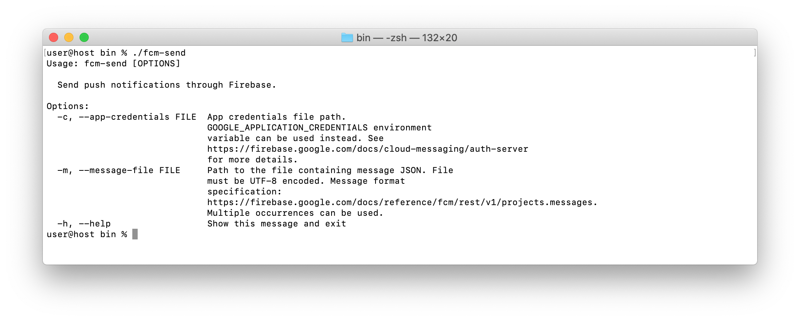

# fcm-send



# Basic steps

1. Download [a private key file for your service account](https://firebase.google.com/docs/cloud-messaging/auth-server#provide_credentials_manually) from the Firebase console.
1. Set the path to this file. 
    ```bash
    export GOOGLE_APPLICATION_CREDENTIALS="/home/user/Downloads/service-account.json"
    ```
1. Create a file with your [message](https://firebase.google.com/docs/reference/fcm/rest/v1/projects.messages).
    ```JSON
    {
        "message": {
            "notification": {
                "title": "FCM push notification",
                "body": "Hello, world!"
            },
            "data": {
                "key1": "value1",
                "key2": "value2"
            },
            "token": "<target_device_registration_token>"
        }
    }
    ```
1. Run `fcm-send`.
    ```bash
    ./fcm-send -m message.json
    ```
    ```bash
    Message sent to Firebase for delivery. Response:
    {
      "name": "projects/<project_id>/messages/0:1572347759805693%14b1c65594b1c645"
    }
    ```

## License

    Copyright (c) 2019 Ruslan Kalbaev

    Licensed under the Apache License, Version 2.0 (the "License");
    you may not use this file except in compliance with the License.
    You may obtain a copy of the License at

    http://www.apache.org/licenses/LICENSE-2.0

    Unless required by applicable law or agreed to in writing, software
    distributed under the License is distributed on an "AS IS" BASIS,
    WITHOUT WARRANTIES OR CONDITIONS OF ANY KIND, either express or implied.
    See the License for the specific language governing permissions and
    limitations under the License.